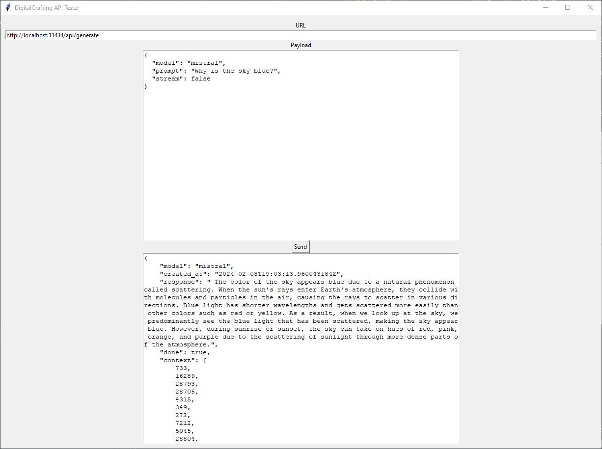

## DigitalCrafting REST Client

This is a desktop application to test APIs. It doesn't require any registration or sign up. 

I needed a simple UI interface to check and compose correct request bodies to communicate with Ollama models running in podman containers on a local machine. Actually, this app can be used with any endpoint that communicates with JSON and doesn't require any authorization. 

You can define the Request URL and the request payload. The response is included in the response section.




## Install

1. `python -m venv digitalcrafting-restclient-env`
2. Activate the environment either via VSCode by selecting the `digitalcrafting-restclient-env` Python interpreter or by calling the `digitalcrafting-restclient-env -> Scripts -> activate` command. 
3. Install dependencies: `pip install -r requirements.txt`

## Run the application

```bash
python app.py
```
